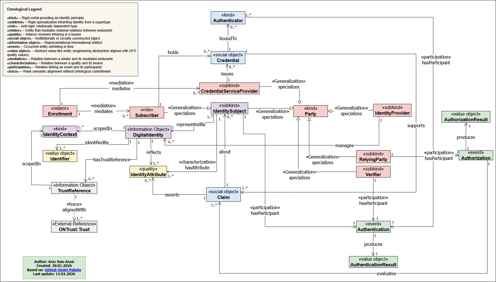

# CM4DI

CM4DI: an ontology for digital identity with trust integration, grounded in UFO, specified in OntoUML, and released as a lightweight OWL artifact.

## Overview

CM4DI (Conceptual Model for Digital Identity) is an ontology-driven conceptual model for digital identity with modular trust integration. It provides a minimal but expressive semantic backbone for identity-centric digital ecosystems by structuring identity-bearing entities, digital identities, credentials, claims, contextual scoping, authentication, authorization, and trust references within a coherent ontological framework.

The model is grounded in the Unified Foundational Ontology (UFO) and specified in OntoUML. This repository documents the current conceptual specification of CM4DI and serves as the foundation for its lightweight OWL operationalization, future scenario-based validation, and subsequent formal enrichment.

## Documentation

The CM4DI ontology core documentation includes:

- Ontology model (OWL)
- Conceptual diagrams
- Field registry
  [CM4DI Field Registry v0.1](CM4DI-field-registry-v0.1.md)
- Profile mappings

## Vision and Evolution

CM4DI is intended as a reusable ontology artifact for digital identity conceptualization, documentation, and progressive formalization. The current release emphasizes:

- a principled ontology-driven conceptual core
- explicit grounding in UFO and OntoUML
- modular trust integration through `TrustReference`
- explicit event-result symmetry for authentication and authorization
- a lightweight publication baseline for documentation and future OWL release

Future releases may extend the current artifact with:

- richer logical axiomatization
- stronger OWL formalization
- example instantiations and case-based mappings
- extension modules for governance, consent, policy, and assurance details
- additional documentation and external ontology alignment mappings

## Scope of the Ontology

CM4DI focuses on the core ontological structure of digital identity. The ontology currently covers:

- identity-bearing entities
- contextual identity representation
- credentials and claims
- identity attributes
- enrollment mediation
- authentication events
- authorization events
- trust references and lightweight external alignment

The following concerns are intentionally outside the current minimal core:

- full governance modeling
- detailed consent and privacy policy layers
- heavy access-control policy formalization
- production deployment concerns
- complete lifecycle orchestration
- deep formalization of external trust ontologies

This scope preserves ontological clarity and keeps the core model minimal, modular, and extensible.

## Ontological Foundations

CM4DI is grounded in the **Unified Foundational Ontology (UFO)** and specified using **OntoUML**.

The model adopts the following ontological distinctions:

- `«kind»` for rigid identity-providing types
- `«subkind»` for rigid specializations
- `«role»` for anti-rigid context-dependent participation
- `«relator»` for materially grounding mediated relations
- `«quality»` for intrinsic moments inhering in bearers
- `«social object»` for institutionally or socially constructed objects
- `«information object»` for representational artifacts
- `«event»` for occurrents unfolding in time
- `«value object»` for abstract value-like constructs used in the engineering view
- `«trace»` for lightweight external semantic alignment

The OWL artifact associated with this repository should be understood as a lightweight operationalization of the conceptual model. It does not attempt to fully reduce all OntoUML/UFO distinctions into OWL, but rather provides a publishable and reusable ontology artifact aligned with the current conceptual specification.

## Repository Contents

This repository contains or is intended to contain the following artifacts:

- `README.md` — repository overview and ontology documentation
- `LICENSE` — repository license
- `cm4di.owl` — lightweight OWL artifact of CM4DI
- `diagram/CM4DI-Generation2-Version15.jpg` — current ontology diagram
- `docs/concepts.md` — optional concept reference documentation
- `docs/relations.md` — optional relation reference documentation
- `docs/competency-questions.md` — optional competency question documentation

## Ontology Design Summary

The CM4DI ontology is centered on the idea that digital identity should be modeled as a structured, context-scoped, ontology-grounded semantic backbone rather than as a collection of isolated protocol constructs.

At the core of the model are:

- **identity-bearing entities**, represented by `Party` and its specializations
- **identity representation artifacts**, represented by `DigitalIdentity`
- **contextual scoping**, represented by `IdentityContext`
- **institutional identity artifacts**, represented by `Credential` and `Claim`
- **intrinsic identity characterization**, represented by `IdentityAttribute`
- **mediated social grounding**, represented by `Enrollment`
- **interaction events**, represented by `Authentication` and `Authorization`
- **explicit event outcomes**, represented by `AuthenticationResult` and `AuthorizationResult`
- **trust alignment hooks**, represented by `TrustReference`

The model explicitly separates:

- rigid identity-bearing entities from context-dependent participation roles
- information objects from social objects
- intrinsic qualities from asserted claims
- interaction mediation from event participation
- core identity structure from external trust semantics

This separation helps avoid category mistakes and supports a clean, extensible, identity-centered ontology.

## Ontology Diagram

The conceptual diagram of the latest CM4DI version is shown below.

## Core Concepts

| Concept | OntoUML Stereotype | Description |
|---|---|---|
| Party | `«kind»` | Base identity-providing entity for all parties participating in the digital identity ecosystem. |
| IdentitySubject | `«subkind»` | A rigid specialization of `Party` that acts as the primary subject of digital identity representation, claims, and attributes. |
| DigitalIdentity | `«information object»` | An informational representation of an `IdentitySubject` within a specific identity context. |
| IdentityContext | `«kind»` | A contextual scope within which digital identity, identifiers, and trust references are interpreted. |
| Identifier | `«value object»` | A value-like identifier used to identify a `DigitalIdentity` within a context. |
| IdentityAttribute | `«quality»` | An intrinsic or descriptive quality inhering in an `IdentitySubject`. |
| Claim | `«social object»` | A socially or institutionally constructed object that is about an `IdentitySubject` and asserts one or more identity attributes. |
| Credential | `«social object»` | A socially or institutionally constructed object issued by a `CredentialServiceProvider` and held by a `Subscriber`. |
| Authenticator | `«kind»` | An authentication mechanism or authenticator entity bound to a credential and participating in authentication events. |
| Authentication | `«event»` | An event in which an identity subject is authenticated through one or more participating entities or artifacts. |
| AuthenticationResult | `«value object»` | A value-like outcome produced by an authentication event. |
| Authorization | `«event»` | An event in which access or authorization is determined based on claims and relying-party participation. |
| AuthorizationResult | `«value object»` | A value-like outcome produced by an authorization event. |
| IdentityProvider | `«subkind»` | A specialization of `Party` responsible for managing digital identities. |
| CredentialServiceProvider | `«subkind»` | A specialization of `Party` responsible for issuing credentials. |
| Verifier | `«subkind»` | A specialization of `Party` participating in authentication for validation or verification purposes. |
| RelyingParty | `«subkind»` | A specialization of `Party` participating in authorization decisions and relying on identity-related information. |
| Subscriber | `«role»` | A context-dependent anti-rigid role that an `IdentitySubject` may assume in order to hold credentials. |
| Enrollment | `«relator»` | A relator materially grounding the mediated relation between a `Subscriber` and a `CredentialServiceProvider`. |
| TrustReference | `«information object»` | A lightweight informational object used to reference and align with external trust semantics without embedding them into the core ontology. |
| ONTrust:Trust | `«external reference»` | An external trust reference aligned through trace semantics rather than full ontological commitment. |

## Core Relations

| Concept 1 | Cardinality (Concept 1 side) | Relation | Arrow Type | Cardinality (Concept 2 side) | Concept 2 | Description |
|---|---:|---|---|---:|---|---|
| IdentitySubject | — | specializes | Generalization | — | Party | `IdentitySubject` is a rigid specialization of `Party`. |
| IdentityProvider | — | specializes | Generalization | — | Party | `IdentityProvider` is a specialization of `Party`. |
| RelyingParty | — | specializes | Generalization | — | Party | `RelyingParty` is a specialization of `Party`. |
| CredentialServiceProvider | — | specializes | Generalization | — | Party | `CredentialServiceProvider` is a specialization of `Party`. |
| Verifier | — | specializes | Generalization | — | Party | `Verifier` is a specialization of `Party`. |
| Subscriber | — | specializes | Generalization | — | IdentitySubject | `Subscriber` is a role played by an `IdentitySubject`. |
| Enrollment | 1 | mediates | Mediation | 0..* | Subscriber | `Enrollment` mediates the relation involving the subscriber role. |
| Enrollment | 1 | mediates | Mediation | 0..* | CredentialServiceProvider | `Enrollment` mediates the relation involving the credential service provider. |
| IdentitySubject | 1..* | representedBy | Open Arrow | 1 | DigitalIdentity | An `IdentitySubject` is represented by one or more `DigitalIdentity` instances; each `DigitalIdentity` represents one `IdentitySubject`. |
| DigitalIdentity | 1 | scopedIn | Open Arrow | 1..* | IdentityContext | A `DigitalIdentity` is scoped in an `IdentityContext`; a context may contain multiple digital identities. |
| DigitalIdentity | 1 | identifiedBy | Open Arrow | 1..* | Identifier | A `DigitalIdentity` is identified by one or more identifiers. |
| IdentitySubject | 1 | hasAttribute | Characterization | 1..* | IdentityAttribute | An `IdentitySubject` has one or more intrinsic identity attributes. |
| DigitalIdentity | 1 | reflects | Open Arrow | 1..* | IdentityAttribute | A `DigitalIdentity` reflects one or more identity attributes. |
| Claim | 1 | about | Open Arrow | 0..* | IdentitySubject | A `Claim` is about an `IdentitySubject`. |
| Claim | 1 | asserts | Open Arrow | 0..* | IdentityAttribute | A `Claim` asserts an `IdentityAttribute`. |
| CredentialServiceProvider | 1 | issues | Open Arrow | 0..* | Credential | A `CredentialServiceProvider` issues credentials. |
| Subscriber | 1 | holds | Open Arrow | 0..* | Credential | A `Subscriber` holds credentials. |
| Credential | 1 | boundTo | Open Arrow | 0..* | Authenticator | A `Credential` is bound to an `Authenticator`. |
| Credential | 1 | supports | Open Arrow | 1..* | Claim | A `Credential` supports one or more claims. |
| IdentitySubject | 1 | hasParticipant | Participation | 1 | Authentication | An `IdentitySubject` participates in an `Authentication` event. |
| Verifier | 1 | hasParticipant | Participation | 1 | Authentication | A `Verifier` participates in an `Authentication` event. |
| Claim | 1..* | hasParticipant | Participation | 1 | Authentication | One or more claims participate in an `Authentication` event. |
| Authenticator | 1..* | hasParticipant | Participation | 1 | Authentication | One or more authenticators may participate in an `Authentication` event. |
| Authentication | 1 | produces | Open Arrow | 1 | AuthenticationResult | An `Authentication` event produces an `AuthenticationResult`. |
| RelyingParty | 1 | hasParticipant | Participation | 1 | Authorization | A `RelyingParty` participates in an `Authorization` event. |
| Authorization | 1 | evaluates | Open Arrow | 1..* | Claim | An `Authorization` event evaluates one or more claims. |
| Authorization | 1 | produces | Open Arrow | 1 | AuthorizationResult | An `Authorization` event produces an `AuthorizationResult`. |
| IdentityProvider | 1 | manages | Open Arrow | 0..* | DigitalIdentity | An `IdentityProvider` manages digital identities. |
| DigitalIdentity | 1 | hasTrustReference | Open Arrow | 0..* | TrustReference | A `DigitalIdentity` may have zero or more trust references. |
| TrustReference | 1 | scopedIn | Open Arrow | 1 | IdentityContext | A `TrustReference` is scoped in an `IdentityContext`. |
| TrustReference | 1 | alignedWith | Trace | 1..* | ONTrust:Trust | A `TrustReference` is weakly aligned with one or more external trust references. |

## Trust Integration Strategy

CM4DI does not model trust as a fully embedded core relator. Instead, it introduces `TrustReference` as a lightweight information object that enables semantic alignment with external trust ontologies through a weak trace relation.

This strategy is intentional and serves several purposes:

- it preserves the minimality of the core ontology
- it avoids over-committing the identity core to a specific trust theory
- it supports modular interoperability
- it enables future alignment with external trust ontologies such as `ONTrust:Trust`
- it maintains a clear separation between identity structure and external trust semantics

In CM4DI, trust is therefore integrated **modularly**, not by embedding full trust semantics into the identity core.

## Current Release Status

This repository reflects the current lightweight release state of CM4DI.

At this stage, the artifact should be understood as:

- a grounded conceptual ontology
- an OntoUML-specified model
- a lightweight OWL-oriented release baseline
- a reusable research artifact for transparency and reuse

The current release also incorporates an explicit event-result symmetry for both authentication and authorization.

## Notes on Model Interpretation

The current model documentation is based on the present CM4DI conceptual diagram. All named concepts and all explicitly represented labeled relations from the model have been captured in this README.

In the current version, `Authorization` explicitly produces `AuthorizationResult`, thereby aligning the authorization structure with the event-result pattern already used for authentication.

## Citation

If you use or refer to this artifact, please cite the associated paper and, where appropriate, the repository itself.

Suggested repository reference text:

**CM4DI Repository. CM4DI: an ontology for digital identity with trust integration, grounded in UFO, specified in OntoUML, and released as a lightweight OWL artifact. GitHub repository.**

A more formal citation entry can be added in future tagged releases.

## License

This project is released under the **Apache License 2.0**. See the `LICENSE` file for details.
